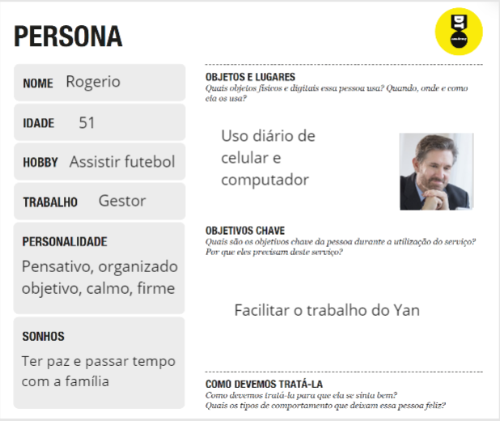
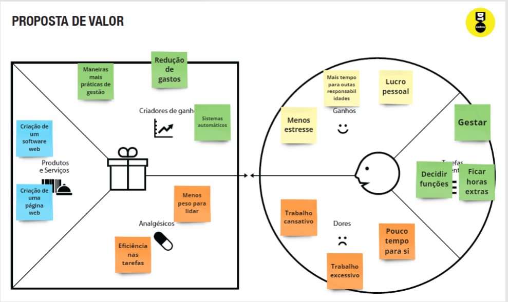
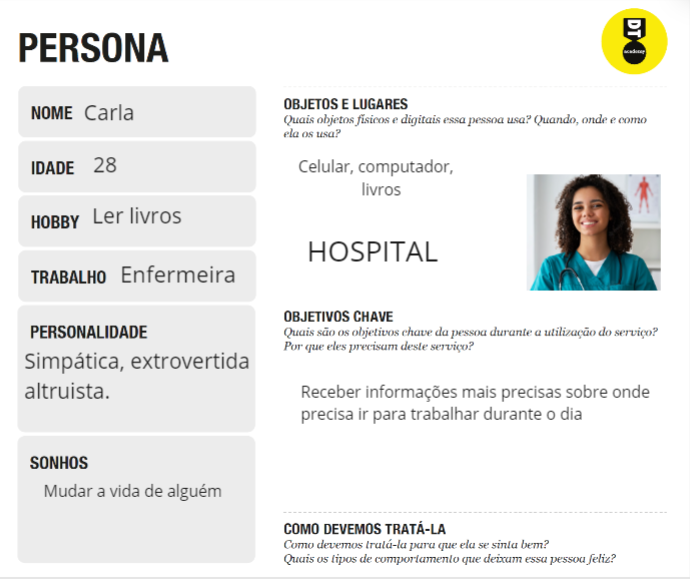
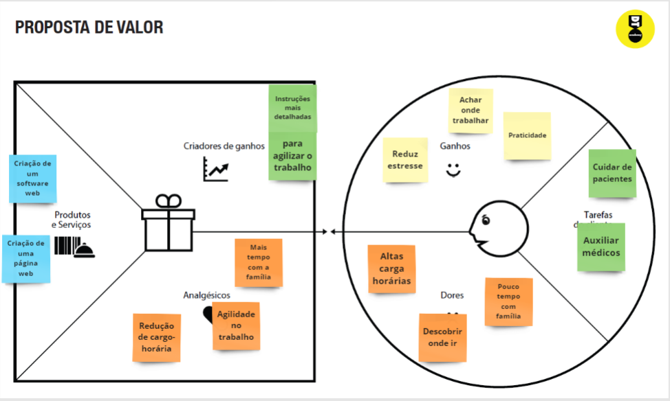
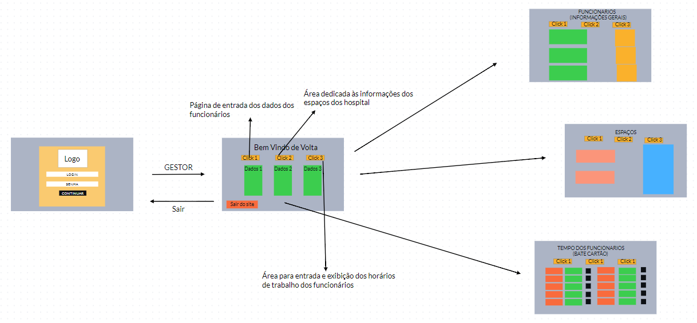
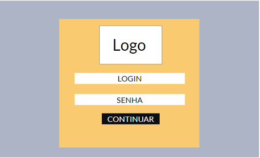
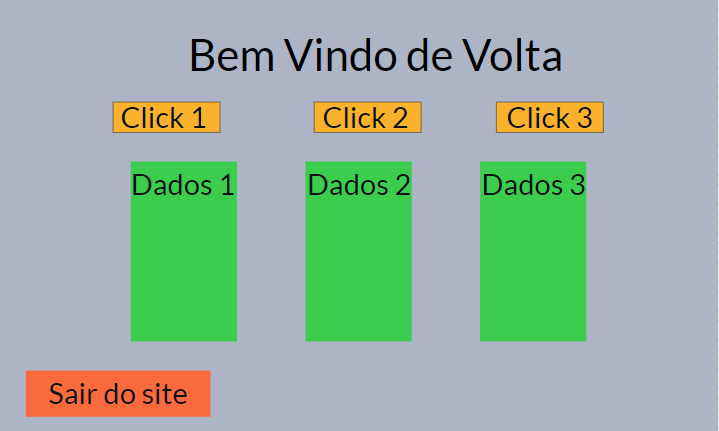
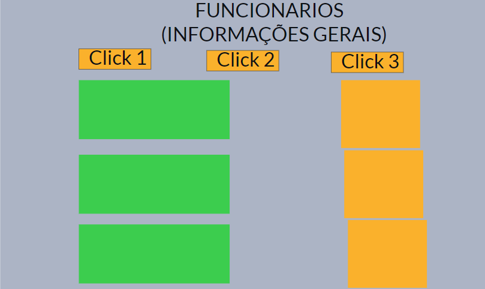
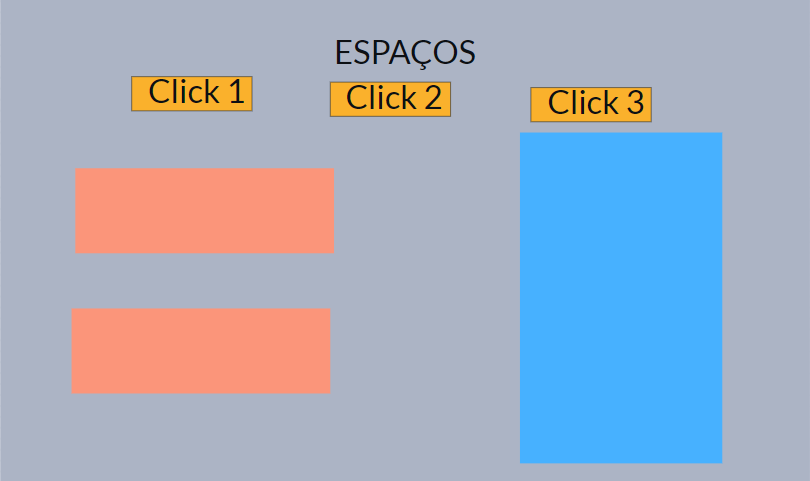
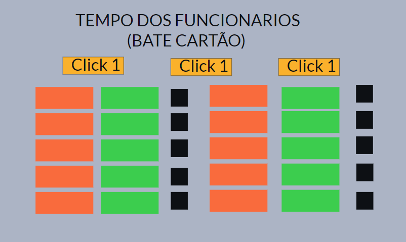

# Informações do Projeto
## Nome do Projeto  

         DynamicTecnologyCount

## Curso 

         CIÊNCIAS DA COMPUTAÇÃO 

## Participantes

    Integrantes:
    - Ana Carolina Couto Machado 
    - Arthur Oliveira Santos 
    - Davi Oliveira Sad
    - Filipe Castro Barbosa Ladeia
    - Matheus Fagundes Araujo
    - Pedro Henrique Magno Gonçalves

# Estrutura do Documento

- [Informações do Projeto](#informações-do-projeto)
  - [Participantes](#participantes)
- [Estrutura do Documento](#estrutura-do-documento)
- [Introdução](#introdução)
  - [Problema](#problema)
  - [Objetivos](#objetivos)
  - [Justificativa](#justificativa)
  - [Público-Alvo](#público-alvo)
- [Especificações do Projeto](#especificações-do-projeto)
  - [Personas, Empatia e Proposta de Valor](#personas-empatia-e-proposta-de-valor)
  - [Histórias de Usuários](#histórias-de-usuários)
  - [Requisitos](#requisitos)
    - [Requisitos Funcionais](#requisitos-funcionais)
    - [Requisitos não Funcionais](#requisitos-não-funcionais)
  - [Restrições](#restrições)
- [Projeto de Interface](#projeto-de-interface)
  - [User Flow](#user-flow)
  - [Wireframes](#wireframes)
- [Metodologia](#metodologia)
  - [Divisão de Papéis](#divisão-de-papéis)
  - [Ferramentas](#ferramentas)
  - [Controle de Versão](#controle-de-versão)
- [**############## SPRINT 1 ACABA AQUI #############**](#-sprint-1-acaba-aqui-)
- [Projeto da Solução](#projeto-da-solução)
  - [Tecnologias Utilizadas](#tecnologias-utilizadas)
  - [Arquitetura da solução](#arquitetura-da-solução)
- [Avaliação da Aplicação](#avaliação-da-aplicação)
  - [Plano de Testes](#plano-de-testes)
  - [Ferramentas de Testes (Opcional)](#ferramentas-de-testes-opcional)
  - [Registros de Testes](#registros-de-testes)
- [Referências](#referências)

# Introdução

 No Brasil 1 em 4 startups acabam oferecendo algum fruto futuro, enquanto as demais acabam ruindo devido a uma má gestão o que impacta em um baixo aproveitamento das mesmas, portanto este trabalho tem como objetivo auxiliar futuras possíveis empresas, bem como as já existentes.

 Paralelo a era digital e o contexto da pandemia, muitas empresas acabam fechando suas portas por não conseguirem se manter no mercado devido a inúmeros fatores como a gestão de tempo, gestão de pessoas, a parte financeira dentre muitos outros que foram responsáveis por culminar em uma queda nas vendas e finalmente no fechamento das empresas. Tendo este cenário de ampla ruína é percetível que algo pode ser feito para facilitar e ajudar na administração das tarefas que são responsáveis por gerar uma queda financeira.

 Perante isso, torna-se fundamental que existam meios de resolver algumas senão todas as problemáticas que uma empresa apresenta. Assim, o foco desta pesquisa está relacionado com um dos hospitais da rede HAPVIDA que tem problemas na gestão de funcionários com  foco no sistema de headcount.

## Problema

 Conforme exposto, o problema que se busca resolver com este projeto é a dificuldade que as empresas têm de fazerem uma gestão adequada de pessoas durante o período de trabalho de seus funcionários. O setor escolhido de trabalho foi hospitais que tem uma grande dificuldade em saber a quantidade de enfermeiros e técnicos de enfermagem necessários para atender as demandas diárias do estabelecimento (headcount).

## Objetivos

 O objetivo geral deste trabalho é criar um aplicativo de gestão de pessoas e horários que apresentem cálculos matemáticos para informar ao gestor a quantidade de enfermeiros e técnicos de enfermagem necessários, bem como o gasto total com seus salários.

 Como objetivos específicos, podemos ressaltar:
>
>- Fornecer um banco de dados que será preenchido pelo gestor para que seja organizado os horários.
>- Fornecer a quantidade ideal de funcionários que atenderam a demanda do estabelecimento baseado em cálculos matemáticos.
>- Um campo individual para cada funcionário ver seu horário e destino no trabalho.

## Justificativa

 Devido ao interesse do grupo em relação ao funcionamento de uma empresa a partir dos funcionários até os maiores cargos, surgiu-se a ideia de abordar tal temática para sanar as dúvidas existentes.
 
 Mutuamente, grande parte dos integrantes do grupo tem algum tipo de relação direta, seja ela familiar ou por amizades, sobre algum tipo de empresa, mas um conhecimento básico sobre as mesmas.
 
 Portanto a área de interesse escolhida pelo grupo foi a saúde, devido ao baixo leque de conhecimento acerca da área e pela oportunidade de aprender e adquirir novas habilidades com este projeto.
 

## Público-Alvo

 Embora grande parte dos enfermeiros irão se beneficiar com a implantação da aplicação, o foco deste trabalho é ajudar na gestão de pessoas do hospital, que como exposto acima não é eficiente e apresenta uma grande dor no setor hospitalar mapeado pelas entrevistas feitas pelo grupo.

 Desta forma, estabeleceu-se como público-alvo desta solução os homens e as mulheres entre 40 e 50 que gerenciam hospitais, tendo frequentemente problemas de contratação e alocação de enfermeiros.
 
# Especificações do Projeto

 A definição exata do problema e os pontos mais relevantes a serem tratados neste projeto foi consolidada com a participação dos usuários em um trabalho de imersão feito pelos membros da equipe a partir da observação dos usuários em seu local natural e por meio de entrevistas. Os detalhes levantados nesse processo foram consolidados na forma de personas e histórias de usuários.
 
 
## Personas, Empatia e Proposta de Valor

> 
>.                     
>
> # ** PERSONA 1 **
>                           
> 
> 
> 
>
> # ** PERSONA 2 **
>
>         
> 
> 
> 
> 
> 
>

## Histórias de Usuários

A partir da compreensão do dia a dia das personas identificadas para o projeto, foram registradas as seguintes histórias de usuários:

|EU COMO... `PERSONA`| QUERO/PRECISO ... `FUNCIONALIDADE` |PARA ... `MOTIVO/VALOR`                 |
|--------------------|------------------------------------|----------------------------------------|
|Rogério  | Uma melhora no sistema de headcount.           | Para agilizar tarefas e conter gastos no hospital.               |
|Carla       | Menor carga horária                | Passar mais tempo com a família. |
|Rogério  | Saber quantas pessoas precisam estar em cada setor.           | Para facilitar a troca de funcionários para cada setor.               |
|Carla       | Ver meus horários e destinos de trabalho no hospital.                 | Evitar ter que procurar saber qual setor eu devo ir em qual horário. |
|Rogério  | Saber o quanto eu estou gastando.           | Facilitar a gerência do hospital.               |
|Carla       | Melhorar o atendimento pela escala de fugulin.                 | Saber os pacientes que precisam de mais cuidado. |
|Rogério  | Evitar ter enfermeiros trabalhando com hora extra.           | Diminuir gastos.               |
|Carla       | Menor pressão no trabalho.                 | Poder pensar melhor para atender melhor. |

> - Headcount:
> 
> Responsável por administrar quantas pessoas devem estar em determinada área do hospital, mas o sistema que gere este tópico apresenta muitas falhas que podem impactar no mau atendimento dos pacientes e em um gasto excessivo.
> - Escala de Fugulin:
> 
> Foi criada para determinar o nível de “risco” que um paciente apresenta e assim pode se decidir quantos enfermeiros um paciente precisa dentro do hospital.
> - Tempo de serviço:
> 
> Principalmente os enfermeiros (as) são prejudicados com os horários devido às horas extras que acabam não sendo opcionais, mas sim obrigatórias devido a dificuldades encontradas no headcount. Assim muitos funcionários ficam longas horas longe de suas famílias e não tem tempo para praticar alguns de seus hobbies.
>

## Requisitos

O escopo funcional do projeto é definido por meio dos requisitos funcionais que descrevem as possibilidades de interação dos gestores e dos enfermeiros, bem como os requisitos não funcionais que descrevem os aspectos que o sistema deverá apresentar de maneira geral. Estes requisitos são apresentados a seguir...

### Requisitos Funcionais

|ID    | Descrição do Requisito  | Prioridade |
|------|-----------------------------------------|----|
|RF-001| O site deve informar ao gestor quantos enfermeiros o hospital necessita baseando-se na quantidade de pacientes e na escala de fugulin. | ALTA | 
|RF-002| O site deverá mostrar os gastos com enfermeiros para o gestor. | ALTA |
|RF-003| O site devera ter uma aba para o gestor entrar com os dados dos enfermeiros e pacientes. |  ALTA |
|RF-004| O site deverá ter um login que separa gestores e enfermeiros para assim adicionar futuras features para os enfermeiros. | BAIXA |

### Requisitos não Funcionais

|ID     | Descrição do Requisito  |Prioridade |
|-------|-------------------------|----|
|RNF-001| O sistema deve ser responsivo para rodar em um dispositivos móveis e desktops | MÉDIA | 
|RNF-002| O site deve calcular a quantidade de enfermeiros necessarios baseado na entrada de dados das informacoes dos gestores e dos bacientes usando a escala de fugulin. |  ALTA | 
|RNF-003| O sistema deve calcular o quanto será economizado, considerando o que é gasto atualmente e o que será gasto com o resultado do site.| ALTA |

## Restrições

O projeto está restrito pelos itens apresentados na tabela a seguir.

|ID| Restrição                                             |
|--|-------------------------------------------------------|
|01| O projeto deverá ser entregue até o final do semestre |
|02| Não pode ser desenvolvido um módulo de backend        |
|03| Não pode resolver o problema de só uma persona        |
|04| Regulamentos e leis: O primeiro ponto a considerar é que um hospital está sujeito a diversas regulamentações e leis que regem sua operação. É importante garantir que todas as mudanças propostas estejam em conformidade com essas regulamentações.      |
|05| Orçamento: É importante trabalhar dentro do orçamento definido para o projeto. As mudanças propostas devem ser realistas e viáveis dentro das restrições financeiras existentes.       |
|06| Disponibilidade de recursos: Recursos como espaço, equipamentos e pessoal precisam ser considerados. É importante garantir que o hospital tenha o espaço e os equipamentos necessários para atender às necessidades dos pacientes.       |
|07| Qualificação dos funcionários: A equipe médica e de enfermagem do hospital deve ter a qualificação necessária para trabalhar nas áreas designadas. É importante garantir que a equipe tenha as habilidades e conhecimentos adequados para as funções que irão desempenhar.       |
|08| Viabilidade técnica: As mudanças propostas devem ser tecnicamente viáveis. É importante garantir que a infraestrutura do hospital possa suportar as mudanças propostas e que não haja impactos negativos nas operações diárias do hospital.|
|09| Tempo: O projeto deve ser concluído dentro de um período de tempo razoável. É importante garantir que as mudanças propostas possam ser implementadas em um prazo realista e que não haja impactos negativos nas operações diárias do hospital durante o processo de implementação. |

# Projeto de Interface

Pensamos em formas de conseguir realizar a proposta feita nas especificações do projeto, a seguir estão imagens com a funcionalidade de cada página webb:

> Para concretizar as demandas pelo software, o grupo decidiu em construir uma página web com foco principalmente no gestor e com possíveis features para os fncionários. Dessa forma disponibilizaremos para o gestor áreas para a visualização e a manipulação de dados da empresa.   [Especificações do
> Projeto](#especificações-do-projeto).

## User Flow

>
> 
> 

## Wireframes

> A tela inicial será uma área de login para que futuramente uma integração com os funcionários seja realizada. Entretanto, por hora apenas o gestor terá um login e senha que o levaram para a segunda página.

> Após o login do gestor, ele será direcionado a está página na qual já terá acesso a alguns dados e poderá transitar ainda por mais três áreas.

> Aqui o gestor terá acesso a informações gerais como o número de funcionáros, sálarios, gastos, dentre outras informações de relevancia.

> Nesta parte estarão dispostas informações relacionadas aos espaços do hospital, como a quantidade de funcionários e necessidades de cada espaço.

> Com está págian será possível visualizar quantos funcionários estão presentes no hospital, a quanto tempo estão trabalhando, dentre outros dados.

# Metodologia

......  COLOQUE AQUI O SEU TEXTO ......

> Nesta parte do documento, você deve apresentar a metodologia 
> adotada pelo grupo, descrevendo o processo de trabalho baseado nas metodologias ágeis, 
> a divisão de papéis e tarefas, as ferramentas empregadas e como foi realizada a
> gestão de configuração do projeto via GitHub.
>
> Coloque detalhes sobre o processo de Design Thinking e a implementação do Framework Scrum seguido
> pelo grupo. O grupo poderá fazer uso de ferramentas on-line para acompanhar
> o andamento do projeto, a execução das tarefas e o status de desenvolvimento
> da solução.
> 
> **Links Úteis**:
> - [Tutorial Trello](https://trello.com/b/8AygzjUA/tutorial-trello)
> - [Gestão ágil de projetos com o Trello](https://www.youtube.com/watch?v=1o9BOMAKBRE)
> - [Gerência de projetos - Trello com Scrum](https://www.youtube.com/watch?v=DHLA8X_ujwo)
> - [Tutorial Slack](https://slack.com/intl/en-br/)

## Divisão de Papéis

......  COLOQUE AQUI O SEU TEXTO ......

> Apresente a divisão de papéis e tarefas entre os membros do grupo.
>
> **Links Úteis**:
> - [11 Passos Essenciais para Implantar Scrum no seu Projeto](https://mindmaster.com.br/scrum-11-passos/)
> - [Scrum em 9 minutos](https://www.youtube.com/watch?v=XfvQWnRgxG0)

## Ferramentas

| Ambiente  | Plataforma              |Link de Acesso |
|-----------|-------------------------|---------------|
|Processo de Design Thinkgin  | Miro | https://miro.com/app/board/uXjVMYD9yI0=/| 
|Repositório de código | GitHub | https://github.com/ICEI-PUC-Minas-PPLCC-TI/ti-1-ppl-cc-m-20231-chickcount| 
|Hospedagem do site |  |  Não existe ainda | 
|Protótipo Interativo | MavelApp | https://marvelapp.com/whiteboard/yRuw6FuNNw9gok27Czjw | 
|Editor de Código| VSCode | Não existe ainda | 
|Divisão de Tarefas| Bitrix24 | https://b24-qhhufh.bitrix24.com.br/company/personal/user/5/tasks/?secret=nkprzss3 |
>
> Liste as ferramentas empregadas no desenvolvimento do
> projeto, justificando a escolha delas, sempre que possível.
> 
> As ferramentas empregadas no projeto são:
> 
> - Vscode: por ser uma plataforma intuitiva e de facil acesso a todos os membros do grupo. 
> - Discord: todos os integrantes já o possuiam e portanto foi a plataforma escolhida para as reuniões.
> - Miro e Marvel: pela sua simplicidade e intuitividade acabaram por ser escolhidos.
> - Plataforma de hospedagem: ainda não foi decidido.
>
> 
> **Links Úteis - Hospedagem**:
> - [Getting Started with Heroku](https://devcenter.heroku.com/start)
> - [Crie seu Site com o HostGator](https://www.hostgator.com.br/como-publicar-seu-site)
> - [GoDady](https://br.godaddy.com/how-to)
> - [GitHub Pages](https://pages.github.com/)

## Controle de Versão

> A ferramenta de controle de versão adotada no projeto foi o
> [Git](https://git-scm.com/), sendo que o [Github](https://github.com)
> foi utilizado para hospedagem do repositório `upstream`.
> 
> O projeto segue a seguinte convenção para o nome de branchs:
> 
> - `master`: versão estável já testada do software
> - `unstable`: versão já testada do software, porém instável
> - `testing`: versão em testes do software
> - `dev`: versão de desenvolvimento do software
> 
> Quanto à gerência de issues, o projeto adota a seguinte convenção para
> etiquetas:
> 
> - `bugfix`: uma funcionalidade encontra-se com problemas
> - `enhancement`: uma funcionalidade precisa ser melhorada
> - `feature`: uma nova funcionalidade precisa ser introduzida
>
> **Links Úteis**:
> - [Tutorial GitHub](https://guides.github.com/activities/hello-world/)
> - [Git e Github](https://www.youtube.com/playlist?list=PLHz_AreHm4dm7ZULPAmadvNhH6vk9oNZA)
> - [5 Git Workflows & Branching Strategy to deliver better code](https://zepel.io/blog/5-git-workflows-to-improve-development/)
>
> **Exemplo - GitHub Feature Branch Workflow**:
>
> 

# **############## SPRINT 1 ACABA AQUI #############**

# Projeto da Solução

......  COLOQUE AQUI O SEU TEXTO ......

## Tecnologias Utilizadas

......  COLOQUE AQUI O SEU TEXTO ......

> Descreva aqui qual(is) tecnologias você vai usar para resolver o seu
> problema, ou seja, implementar a sua solução. Liste todas as
> tecnologias envolvidas, linguagens a serem utilizadas, serviços web,
> frameworks, bibliotecas, IDEs de desenvolvimento, e ferramentas.
> Apresente também uma figura explicando como as tecnologias estão
> relacionadas ou como uma interação do usuário com o sistema vai ser
> conduzida, por onde ela passa até retornar uma resposta ao usuário.
> 
> Inclua os diagramas de User Flow, esboços criados pelo grupo
> (stoyboards), além dos protótipos de telas (wireframes). Descreva cada
> item textualmente comentando e complementando o que está apresentado
> nas imagens.

## Arquitetura da solução

......  COLOQUE AQUI O SEU TEXTO E O DIAGRAMA DE ARQUITETURA .......

> Inclua um diagrama da solução e descreva os módulos e as tecnologias
> que fazem parte da solução. Discorra sobre o diagrama.
> 
> **Exemplo do diagrama de Arquitetura**:
> 
> 

# Avaliação da Aplicação

......  COLOQUE AQUI O SEU TEXTO ......

> Apresente os cenários de testes utilizados na realização dos testes da
> sua aplicação. Escolha cenários de testes que demonstrem os requisitos
> sendo satisfeitos.

## Plano de Testes

......  COLOQUE AQUI O SEU TEXTO ......

> Enumere quais cenários de testes foram selecionados para teste. Neste
> tópico o grupo deve detalhar quais funcionalidades avaliadas, o grupo
> de usuários que foi escolhido para participar do teste e as
> ferramentas utilizadas.
> 
> **Links Úteis**:
> - [IBM - Criação e Geração de Planos de Teste](https://www.ibm.com/developerworks/br/local/rational/criacao_geracao_planos_testes_software/index.html)
> - [Práticas e Técnicas de Testes Ágeis](http://assiste.serpro.gov.br/serproagil/Apresenta/slides.pdf)
> -  [Teste de Software: Conceitos e tipos de testes](https://blog.onedaytesting.com.br/teste-de-software/)

## Ferramentas de Testes (Opcional)

......  COLOQUE AQUI O SEU TEXTO ......

> Comente sobre as ferramentas de testes utilizadas.
> 
> **Links Úteis**:
> - [Ferramentas de Test para Java Script](https://geekflare.com/javascript-unit-testing/)
> - [UX Tools](https://uxdesign.cc/ux-user-research-and-user-testing-tools-2d339d379dc7)

## Registros de Testes

......  COLOQUE AQUI O SEU TEXTO ......

> Discorra sobre os resultados do teste. Ressaltando pontos fortes e
> fracos identificados na solução. Comente como o grupo pretende atacar
> esses pontos nas próximas iterações. Apresente as falhas detectadas e
> as melhorias geradas a partir dos resultados obtidos nos testes.

# Referências

......  COLOQUE AQUI O SEU TEXTO ......

> Inclua todas as referências (livros, artigos, sites, etc) utilizados
> no desenvolvimento do trabalho.
> 
> **Links Úteis**:
> - [Formato ABNT](https://www.normastecnicas.com/abnt/trabalhos-academicos/referencias/)
> - [Referências Bibliográficas da ABNT](https://comunidade.rockcontent.com/referencia-bibliografica-abnt/)
